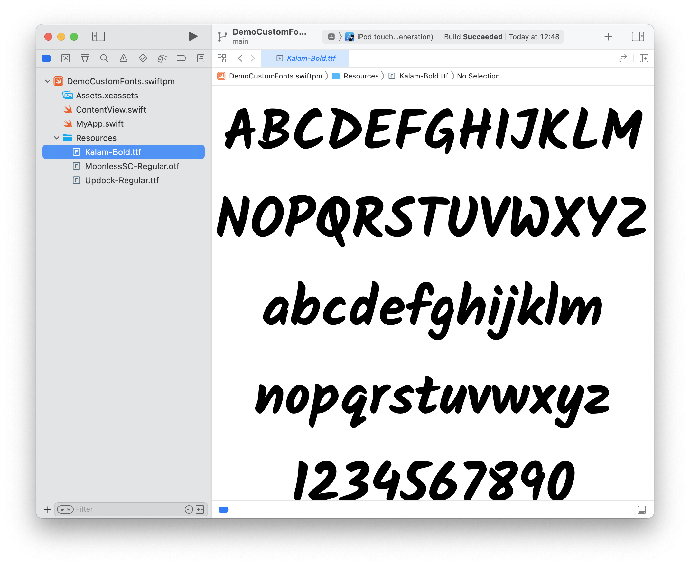
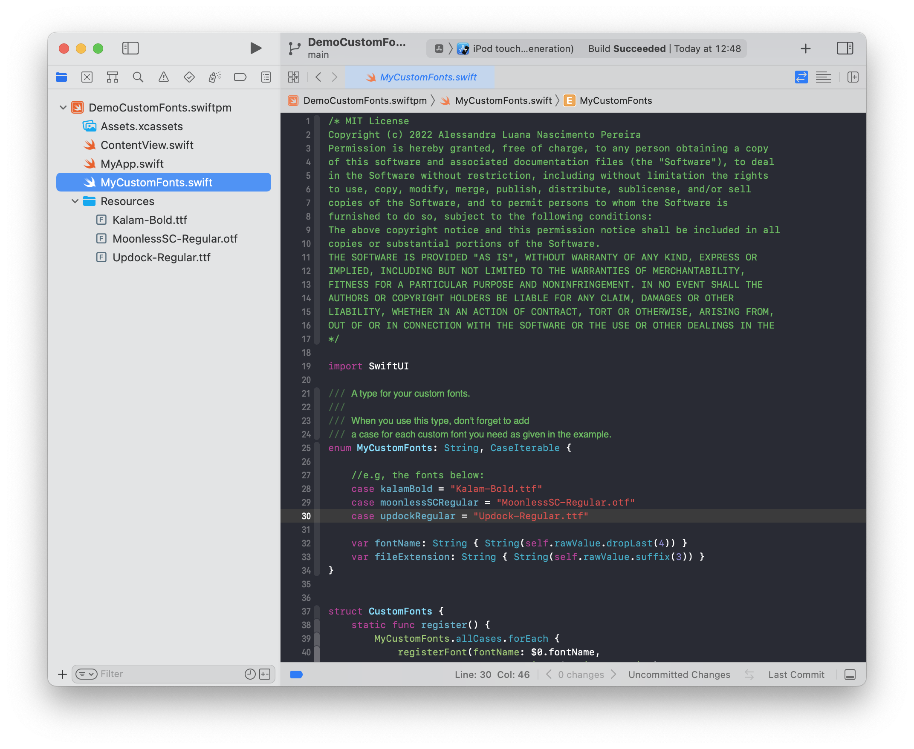
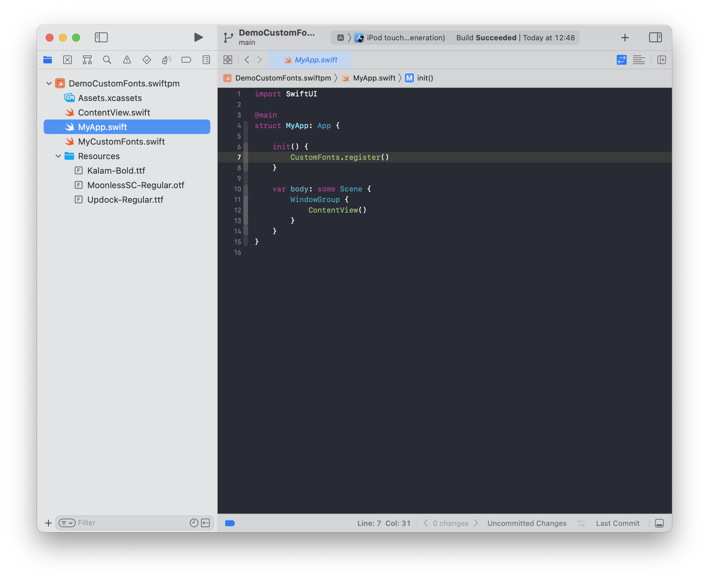
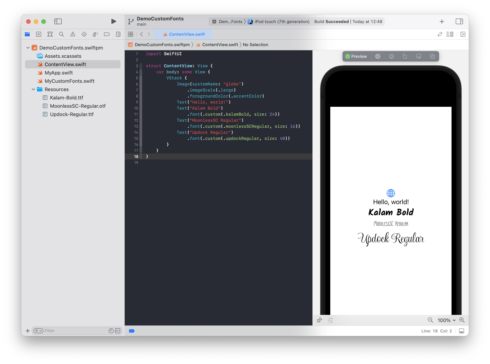

# Custom-font-in-Swift-Playgrounds-App
Custom font usage example for Swift Playgrounds App

### Como adicionar uma fonte ao projeto do Swift Playgrounds App
1. Adicione os arquivos das fontes ao seu projeto. O próprio Xcode irá colocá-las numa pasta chamada de "Resources";

2. Copie o arquivo "MyCustomFonts.swift" desse repositório para o seu projeto;
3. Inclua um novo "case" para cada fonte adicionada com o nome e extensão do arquivo;

4. Adicione na inicialização do seu App o código "CustomFonts.register()" para registrar todas as fontes adicionadas;

5. Pronto! Agora, basta utilizar como no exemplo dado.

